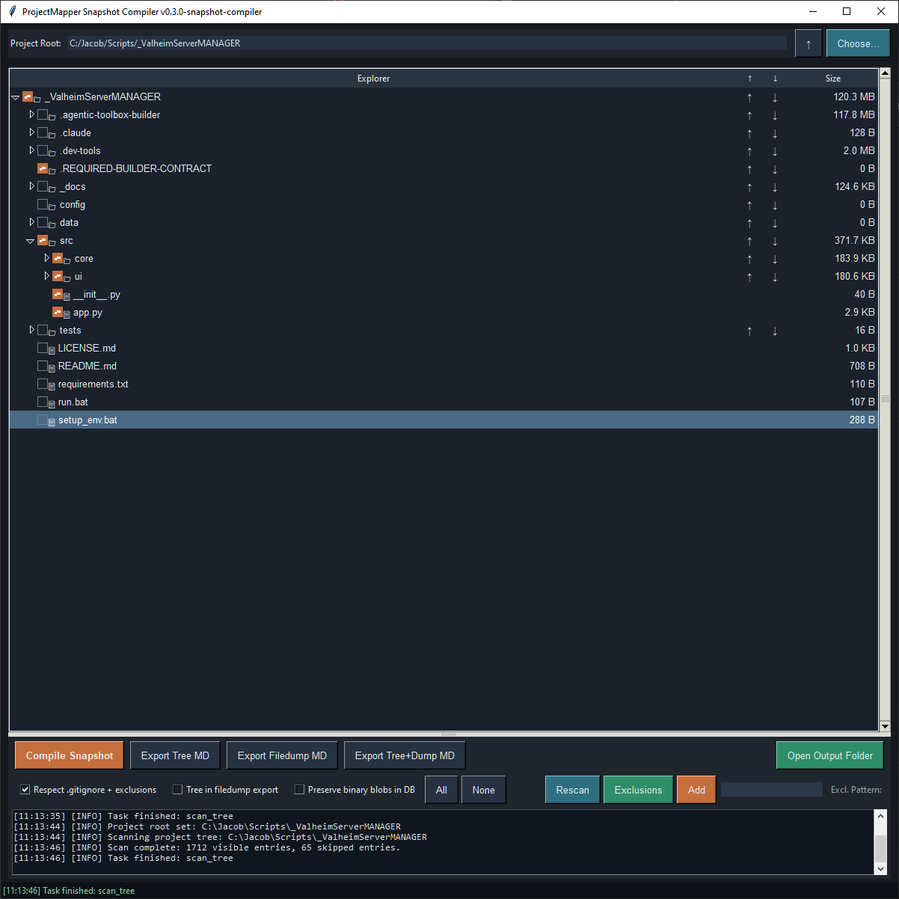

# ProjectMapper Snapshot Compiler

ProjectMapper Snapshot Compiler is a small desktop utility for translating a project folder into a portable SQLite snapshot. It is intended to make project state easier to inspect, share, archive, and hand off to agents or other tools.

The app scans a selected root folder, displays the project tree, allows files and folders to be included or excluded, and compiles the selected project state into a SQLite database.



## Core Purpose

ProjectMapper creates a point-in-time project snapshot that can include:

- Project folder structure
- Selected text-readable file contents
- Inclusion and exclusion state
- Skipped path records
- Exclusion rules
- Local environment hints
- Embedded snapshot manifest
- Optional markdown projections
- Optional binary blob preservation for backup/rehydration use

The SQLite snapshot is the primary truth source. Markdown exports are derived views intended for easier reading or sharing.

## Main Workflow

1. Choose a project root folder.
2. Review the generated folder tree.
3. Check or uncheck files and folders as needed.
4. Add exclusion patterns if necessary.
5. Compile the SQLite snapshot.
6. Optionally export markdown views:
   - Project tree
   - Filedump
   - Combined tree and filedump

## Managing Exclusions

Click **Exclusions** to open the resizable rule manager. It lists built-in rules,
custom filename patterns, and supported rules imported from the current root's
`.gitignore`, with their source and match type.

- Check **Exclude (hide)** to hide matching files/folders from the mapper. Uncheck it
  to allow matches, unless another rule excludes them. The tree refreshes automatically.
- Use **Select** to choose rows for batch actions without changing what the mapper shows.
- **Select All** and **Deselect All** change the row selection.
- **Exclude Selected** turns on the selected exclusion rules; **Allow Selected** turns
  them off. **Delete Selected** removes the selected rules.
- Add a filename pattern such as `*.tmp` directly in the manager. Patterns use
  wildcards, not regular expressions.

Changes last for the current app session. Deleting an imported rule removes it
from the app's exclusion policy without editing `.gitignore`; rescanning does not
restore it during that session. Overrides for imported rules are scoped to their
project root. Built-in and custom rule changes apply across roots in the session.
Unchecking the main **Apply exclusions (hide matches)** switch allows matches without
clearing the individual rule checkboxes. A path matching multiple rules remains
excluded until all matching rules are disabled or deleted. Compile a new snapshot
after changing exclusions to capture the updated tree and rule states.

## Single-File Transformations

Right-click a file in the project tree and choose **Tokenizing Patcher…**
(or focus the file and press **Shift+F10**). This opens the selected file without
changing its snapshot inclusion checkbox.

1. Paste a JSON patch or use **Load Patch JSON**. **Copy Schema** copies an example.
2. Choose **Validate / Preview** to resolve all hunks and inspect the diff.
3. Choose **Apply to Result** to inspect the complete transformed text.
4. Choose **Save Result** to write the result to the target, or enable **Save as
   version** and supply a suffix such as `_v2` to create a sibling file.

Click the **&** between Validate and Apply to link them. The group turns purple;
either button then validates the current patch and applies it to Result in one
click. Failed validation stops the chain. Click **&** again to restore separate
actions. Saving remains a separate step in both modes.

```json
{
  "hunks": [
    {
      "description": "Change the greeting",
      "search_block": "print('Hello')",
      "replace_block": "print('Welcome')",
      "use_patch_indent": false
    }
  ]
}
```

Hunks match complete lines, first exactly, then with leading/trailing spaces and
tabs ignored. Every hunk is located against the original source; missing,
ambiguous, and overlapping matches reject the entire patch. An empty replacement
deletes the matched lines. By default, replacements inherit the target's base
indentation and retain the replacement's relative indentation. A hunk's
`use_patch_indent: true` keeps its supplied indentation; **Force patch indentation**
overrides all hunks, including those explicitly set to false.

The patcher supports UTF-8 text, preserves a UTF-8 BOM and target newline style,
and preserves line endings outside replaced blocks. Patch edits invalidate the
preview. Saving refuses to overwrite externally changed source files or existing
version files. Source, diff, and result are separate views; the diff is never saved
as source. A successful save refreshes the tree and requires a new snapshot before
exporting in the current app session. There is no automatic backup when overwriting;
use **Save as version** to retain the original.

The patcher implementation lives in `src/patcher.py` and `src/patcher_ui.py`.
The disposable `.parts/` folder is reference material only: it is never imported,
is not included in vendor exports, and is protected from patcher writes. It can
be removed without affecting the application. Whole-project transformations are
not implemented yet.

## Creating New Text Files

Right-click a folder or file and choose **New Text File…** to open TextTOUCHER.
The destination starts at the selected folder, or beside the selected file.
**Choose Folder…** changes the destination.

Enter a name, choose an extension, and optionally paste or type content. An
extension typed in the name takes precedence over the preset. Choose **(None)**
for an extensionless file; dotfiles such as `.gitignore` keep their exact names.
**Append date/time to filename** adds a timestamp before the extension.

**Create File** writes UTF-8 text exactly as entered (including empty content),
refreshes the project tree, and requires a fresh snapshot before exporting in the
current session. Files matching exclusion rules remain hidden until allowed.
The form clears after success so another file can be created in the same folder.
Existing files are never overwritten, and failed creation keeps the form content.
The `.parts/` reference folder is protected from creation as well as patching.

The implementation is in `src/text_toucher.py`; it has no dependency on the
reference script or `.parts/` folder.

## Blank-Slate Vendor Export

ProjectMapper can export a clean, vendible copy of itself for external testing.
This is separate from project snapshot exports. It creates an installable app
folder and zip under `vendor_exports/` with no Git history, virtual environment,
Python caches, previous `_projectmapper` records, SQLite snapshot databases,
logs, local `.env*` files, or generated export history.

From the UI, use:

```text
Export Vendor App
```

From the command line:

```bash
python tools/export_vendor_app.py
```

The generated package includes an `INSTALL_FRESH_START.md` file for testers.
The expected fresh-start test is:

1. Copy or unzip the vendor export into a blank external test project.
2. Run `setup_env.bat`.
3. Run `run.bat`.
4. Choose a project root in the app and compile a new snapshot.

New test records are created only when the exported app is run against a chosen
project root.

## Snapshot Outputs

By default, ProjectMapper writes outputs to a `_projectmapper` folder inside the selected project root.

Typical outputs include:

```text
<ProjectName>_snapshot.sqlite3
<ProjectName>_project_tree.md
<ProjectName>_project_filedump.md
<ProjectName>_project_tree_and_filedump.md
```

## SQLite Snapshot Contents

The snapshot database may include tables such as:

```text
snapshot_metadata
snapshot_manifest
project_tree
project_files
project_blobs
snapshot_exclusion_rules
snapshot_skipped_paths
snapshot_mapper_state
snapshot_environment
snapshot_outputs
snapshot_errors
```

`project_files` stores selected text-readable files.

`project_blobs` is optional and is used only when binary blob preservation is enabled.

## Markdown Exports

The project tree export is useful as a lightweight surface map of the project. It can be shared without including the full file contents, allowing an agent or reviewer to see the project shape and request specific follow-up files when needed.

The filedump export contains selected captured text files.

The combined export places the project tree before the filedump for easier single-document handoff.

## Binary Preservation

Binary blob preservation is optional and disabled by default.

When enabled, selected binary-like files can be stored in the SQLite snapshot as blobs. This allows the snapshot to serve more like a backup or rehydration artifact, while the default mode remains lighter and more suitable for agent communication.

## Running

From the project root:

```bash
python src/app.py
```

Or, depending on the local environment:

```bash
py src/app.py
```

## Notes

ProjectMapper's main Tkinter application is organized with section markers in
`src/app.py`. The single-file transformation engine and patcher window are separate
modules, keeping transformation logic independently testable.
