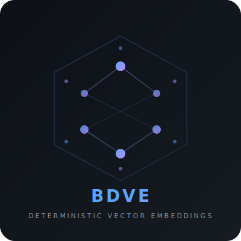

# BDVE Embedder Demo

**Interactive demo of the BDVE (Bidirectional Deterministic Vector Embeddings) pipeline.**

This is a standalone showcase — it runs in its own virtual environment,
isolated from the parent project. No GPU, no API keys, no model server.

<p align="center">
  
</p>

---

## What This Demonstrates

The BDVE embedder converts text into semantic vectors using pure math
instead of a neural network. This demo lets you train a model on any
text file and step through every stage of the pipeline interactively:

| Step | Operation | What You See |
|------|-----------|-------------|
| 0 | **Train** | Pick a `.txt` file → train BPE tokenizer + build embeddings |
| 1 | **Tokenize** | Raw text → BPE subword tokens |
| 2 | **Chunk** | Tokens split into budget-bounded hunks |
| 3 | **Embed** | Each hunk → dense vector (with heatmap visualisation) |
| 4 | **Reverse** | Each vector → nearest tokens by cosine similarity |

Before training, the demo runs with placeholder stubs so you can
explore the UI immediately. After training on a file, all operations
use the real BPE-SVD pipeline with meaningful results.

All results stay on screen until you explicitly clear them or re-run.

---

## Quick Start

### 1. Install

```bash
# Windows
install.bat

# macOS / Linux
chmod +x install.sh && ./install.sh
```

This creates an isolated `.venv` inside `_showcase/` — your system Python
and the parent project's environment are untouched.

### 2. Train a Model

In the GUI, click **Train from File** and select any `.txt` file. The
status bar shows progress as the pipeline runs (typically 5-30 seconds).

Or from the CLI:

```bash
# Windows
run_cli.bat train path\to\your\file.txt

# macOS / Linux
./run_cli.sh train path/to/your/file.txt
```

Training produces two artifacts in `_showcase/artifacts/`:
- `tokenizer.json` — BPE vocabulary and merge rules
- `embeddings.npy` — dense token embedding matrix

These persist across restarts — no need to retrain each time.

### 3. Run the GUI

```bash
# Windows
run_ui.bat

# macOS / Linux
./run_ui.sh
```

A splash screen with the BDVE logo appears briefly, then the main
window opens with a dark-themed interface.

### 4. Run the CLI

```bash
# Windows
run_cli.bat tokenize "the king wore a golden crown"
run_cli.bat chunk "the king wore a golden crown" --budget 5
run_cli.bat embed "the king wore a golden crown" --budget 5
run_cli.bat reverse "the king wore a golden crown" --budget 5 --top-k 3
run_cli.bat pipeline "the king wore a golden crown" --budget 5

# macOS / Linux
./run_cli.sh tokenize "the king wore a golden crown"
./run_cli.sh pipeline "the king wore a golden crown" --budget 5
```

---

## CLI Commands

| Command | Description | Example |
|---------|-------------|---------|
| `train` | Train model from a text file | `train corpus.txt --dims 64` |
| `tokenize` | Text → BPE tokens | `tokenize "hello world"` |
| `chunk` | Text → budget-bounded hunks | `chunk "hello world" --budget 5` |
| `embed` | Text → hunks → vectors | `embed "hello world" --budget 5` |
| `reverse` | Vectors → nearest tokens | `reverse "hello world" --top-k 3` |
| `pipeline` | All steps end-to-end | `pipeline "hello world" --budget 5` |

**Flags:**
- `--budget N` — max tokens per hunk (default: 10)
- `--top-k N` — nearest tokens to show per vector (default: 5)
- `--json` — also print machine-readable JSON output
- `--vocab-size N` — BPE vocabulary size for training (default: 2000)
- `--dims N` — embedding dimensions for training (default: 64)

---

## GUI Overview

```
┌────────────────────────────────────────────────────────────────────┐
│  BDVE  [Train from File] ● Model ready │ [Tokenize] ... │ [Clear] │
├────────────────────┬───────────────────────────────────────────────┤
│                    │                                               │
│  Input Text        │  Results                                      │
│  ┌──────────────┐  │  ┌─ Tokenize ─────────────────────┐          │
│  │ Enter your   │  │  │ tokens: [the] [king] [</w>]... │          │
│  │ text here... │  │  └────────────────────────────────┘          │
│  │              │  │  ┌─ Chunk (budget=5) ──────────────┐         │
│  └──────────────┘  │  │ Hunk 0: [the] [king] [wore]    │          │
│                    │  │ Hunk 1: [a] [golden] [crown]    │          │
│  Token Budget      │  └────────────────────────────────┘          │
│  [    10    ]      │  ┌─ Embed ─────────────────────────┐         │
│                    │  │ Hunk 0 → 64d ████████████████   │          │
│  [Run Full Pipeline] │ Hunk 1 → 64d ██████████████     │          │
│                    │  └────────────────────────────────┘          │
│                    │  ┌─ Reverse ───────────────────────┐         │
│                    │  │ Hunk 0: king cos=+0.89          │          │
│                    │  │         crown cos=+0.73         │          │
│                    │  └────────────────────────────────┘          │
├────────────────────┴───────────────────────────────────────────────┤
│  Training complete — model ready                                   │
└────────────────────────────────────────────────────────────────────┘
```

- **Toolbar**: Train from File button + model indicator + step buttons + Clear
- **Left panel**: Text input + token budget control + "Run Full Pipeline" button
- **Right panel**: Scrollable results area — cards accumulate as you run steps
- **Status bar**: Current operation / training progress feedback

---

## Project Structure

```
_showcase/
├── README.md              ← you are here
├── install.bat / .sh      ← creates isolated .venv
├── run_ui.bat / .sh       ← launches graphical demo
├── run_cli.bat / .sh      ← launches CLI demo
├── requirements.txt       ← numpy + scipy
├── artifacts/             ← trained model artifacts (created by training)
│   ├── tokenizer.json     ← BPE vocabulary + merge rules
│   └── embeddings.npy     ← dense token embedding matrix
├── assets/
│   └── logo.svg           ← BDVE logo
└── embedder_demo/
    ├── __init__.py
    ├── __main__.py         ← python -m embedder_demo entry
    ├── core.py             ← training pipeline + inference provider (swap point)
    ├── ui.py               ← tkinter GUI with splash screen + training
    └── cli.py              ← argparse CLI with coloured output + train command
```

### Architecture

`core.py` is the sole interface between the BDVE engine and the UI/CLI.
The four public functions (`tokenize`, `chunk`, `embed_hunk`, `reverse_vector`)
and their return types define the contract — the UI and CLI consume those
shapes and never import from the `bpe_svd` package directly.

When no model is loaded, these functions return placeholder data (stubs).
After training or loading saved artifacts, they transparently switch to
real BPE-SVD operations.

---

## Requirements

- Python 3.11+
- tkinter (included with standard Python on Windows; may need
  `python3-tk` on Linux)
- numpy + scipy (installed automatically by the install script)
- bpe_svd package (installed from `packages/bpe_svd` by the install script)

No GPU. No model server. No API keys. No internet connection required.

---

## About BDVE

For the full technical details:
- [Project README](../README.md) — practical overview for developers
- [Mathematical Foundations](../docs/BPE_SVD_WHITEPAPER.md) — formal derivation of the pipeline

*Part of the [Graph Manifold](../README.md) project.*
